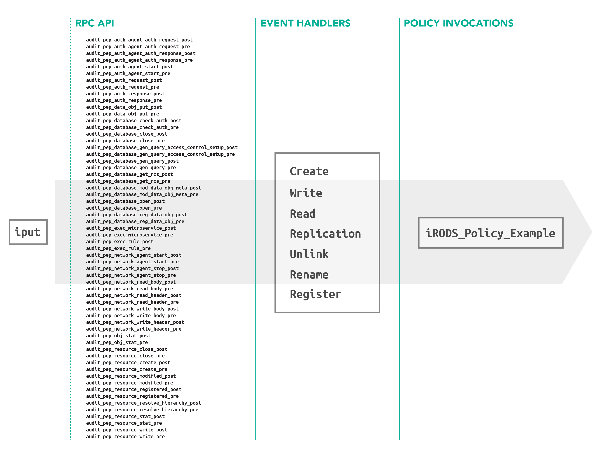

# Motivation

The process for creating and deploying policy for iRODS requirest the rule author to have a complete understanding of the API for iRODS as well as the associated plugin architecture in order to properly leverage the dynamic policy enforcement.  The author will also need to trigger the same policy in multiple ways in order to cover all possible means to move data into iRODS for both object and POSIX data movement.  The goal of this framework is to streamline the craft and deployment of policy, as well as provide a reusable body of policy that may be easily configured.  Policy should now be a matter of configuration and not specifically crafted code which may follow a documented means of deployment for most use cases.

## The Policy Interface

All policy to be invoked by this system must conform to a simple interface of two parameters which are serialized JSON strings, the parameters and the configuration.  This policy may be implemented in any rule language or as a simple rule engine plugin.

For example, in the iRODS Rule Language
```ruby
irods_policy_example_policy_implementation(*parameters, *configuration) {
    writeLine("stdout", "Hello, World!")
}
```

Or in the Python rule language:
```python
def irods_policy_example_policy_implementation(rule_args, callback, rei):
# Parameters    rule_args[1]
# Configuration rule_args[2]
```

The `parameters` contain all the information captured by the event handler, or may be passed in as a prepopulated JSON object when configured.  These values may change depending on how the policy is configured and the contract between the policy and the event handlers used.  The `configuration` may contain any other pertinent information that the policy may need at the time of invocation.  This is a way to externalize any vairables the policy may leverage, such as the given attribute to use for metadata application.

Policy may be invoked directly, by an event handler or by the Query Processor which will be discussed later.

## Event Handlers

Event handlers are a classification of rule engine plugin which consume dynamic policy enforcement points related to a noun within iRODS and invoke policy configured for events generated by the plugin.  There will exist one event handler per noun in the system, the first two of which are Data Objects and Metadata.

The complete list is:
* Data Objects
* Collections
* Metadata
* Resources
* Users and Groups

The Data Object event handler unifies both the Object and POSIX semantics, as well as other iRODS specific operations such as registration, into a single point of truth for invoking policy related to data access.  The plugin maps policy enforcement points to specific set of event for which policy may be configured.  For example:

```cpp
 pep_api_bulk_data_obj_put_pre        "CREATE"
 pep_api_data_obj_chksum_pre          "CHECKSUM"
 pep_api_data_obj_copy_pre            "COPY"
 pep_api_data_obj_create_and_stat_pre "CREATE"
 pep_api_data_obj_create_pre          "CREATE"
 pep_api_data_obj_get_pre             "GET"
 pep_api_data_obj_lseek_pre           "SEEK"
 pep_api_data_obj_phymv_pre           "REPLICATION"
 pep_api_data_obj_put_pre             "PUT"
 pep_api_data_obj_rename_pre          "RENAME"
 pep_api_data_obj_repl_pre            "REPLICATION",
 pep_api_data_obj_trim_pre            "TRIM"
 pep_api_data_obj_truncate_pre        "TRUNCATE"
 pep_api_data_obj_unlink_pre          "UNLINK"
 pep_api_phy_path_reg_pre             "REGISTER"
```



The policy to be invoke is a matter of the plugin specific configuration within `/etc/irods/server_config.json` for a given instance of an event handler.  The "plugin_specific_configuration" object for the given instance will look for a JSON array "policies_to_invoke", which itself is a series of JSON objects.  These objects are the configuration of a policy to invoke for a given series of events.  The policy objects contain:
* conditional
* active_policy_clauses
* events
* policy

### Conditional
A conditional describes a set of conditions which must be met in order to invoke the policy.  These are a series of regular expressions which match the nouns involved.  This could be the `logical_path`, `metadata`, `user_name`, `source_resource`, or `destination_resource`.  A compete example might be:

```json
"conditional" : {
    "logical_path" : "/tempZone/home/*",
    "metadata" : {
        "attribute" : "foo*",
        "value" : "bar*",
        "units" : "baz*",
        "entity_type" : "data_object"
    },
    "source_resource" : "src*",
    "destination_resource" : "dest*"
}
```

The "entity_type" for the metadata maps to the iRODS nouns which are: "data_object", "collection", "resource", and "user".

### Active Policy Clauses
"active_policy_clauses" is configured as a JSON array of one or more of the following: `"pre", "post", "except", "finally"` which map to which dynamic policy enforcement points are triggered in the operation flow.

### Events
"events" is also configured as a JSON array of strings which map to the events generated by the event handler.  For the data object modified event handler an event may be on or more of the following `"create", "checksum", "copy", "get", "seek", "replication", "put", "rename", "trim", "truncate", "unlink", "register"`

### Policy
"policy" is a JSON string which is the name of the policy to invoke.  Following the "policy" is a "configuration" object which contains any specific information related to that given policy.

### Parameters
The data object modified event handler captures all variables within the dataObjInp_t and rsComm_t which are then seralized to JSON and passed to the invoked policy.  Additional information such as the event, associated policy enforcement point are also included.

```json
{
"comm":{
    "auth_scheme":"native","client_addr":"152.54.8.141","proxy_auth_info_auth_flag":"5","proxy_auth_info_auth_scheme":"",
    "proxy_auth_info_auth_str":"","proxy_auth_info_flag":"0","proxy_auth_info_host":"","proxy_auth_info_ppid":"0",
    "proxy_rods_zone":"tempZone","proxy_sys_uid":"0","proxy_user_name":"rods","proxy_user_other_info_user_comments":"",
    "proxy_user_other_info_user_create":"","proxy_user_other_info_user_info":"","proxy_user_other_info_user_modify":"",
    "proxy_user_type":"","user_auth_info_auth_flag":"5","user_auth_info_auth_scheme":"","user_auth_info_auth_str":"",
    "user_auth_info_flag":"0","user_auth_info_host":"","user_auth_info_ppid":"0","user_rods_zone":"tempZone",
    "user_sys_uid":"0","user_user_name":"rods","user_user_other_info_user_comments":"","user_user_other_info_user_create":"",
    "user_user_other_info_user_info":"","user_user_other_info_user_modify":"","user_user_type":""
    },
"cond_input":{
    "dataIncluded":"","dataType":"generic","destRescName":"ufs0","noOpenFlag":"","openType":"1",
    "recursiveOpr":"1", "resc_hier":"ufs0","selObjType":"dataObj","translatedPath":""
    },
"create_mode":"33204",
"data_size":"1",
"event":"CREATE",
"num_threads":"0",
"obj_path":"/tempZone/home/rods/test_put_gt_max_sql_rows/junk0083",
"offset":"0",
"open_flags":"2",
"opr_type":"1",
"policy_enforcement_point":"pep_api_data_obj_put_post"
}
```


## Example Configuration :: Synchronous Replication
```JSON
{
    "instance_name": "irods_rule_engine_plugin-event_handler-data_object_modified-instance",
    "plugin_name": "irods_rule_engine_plugin-event_handler-data_object_modified",
    "plugin_specific_configuration": {
        "policies_to_invoke" : [
            {
                "conditional" : {
                    "logical_path" : "\/tempZone.*"
                },
                "active_policy_clauses" : ["post"],
                "events" : ["create", "write", "registration"],
                "policy" : "irods_policy_data_replication",
                "configuration" : {
                    "source_to_destination_map" : {
                        "edge_resource_0" : ["long_term_resource_0"],
                        "edge_resource_1" : ["long_term_resource_1"],
                    }
                }
            },
            {
                "conditional" : {
                    "logical_path" : "\/tempZone.*"
                },
                "active_policy_clauses" : ["pre"],
                "events" : ["get"],
                "policy" : "irods_policy_data_replication",
                "configuration" : {
                    "source_to_destination_map" : {
                        "long_term_resource_0" : ["edge_resource_0"],
                        "long_term_resource_1" : ["edge_resource_1"]                      
                    }
                }
            }
        ]
    }
}
```
